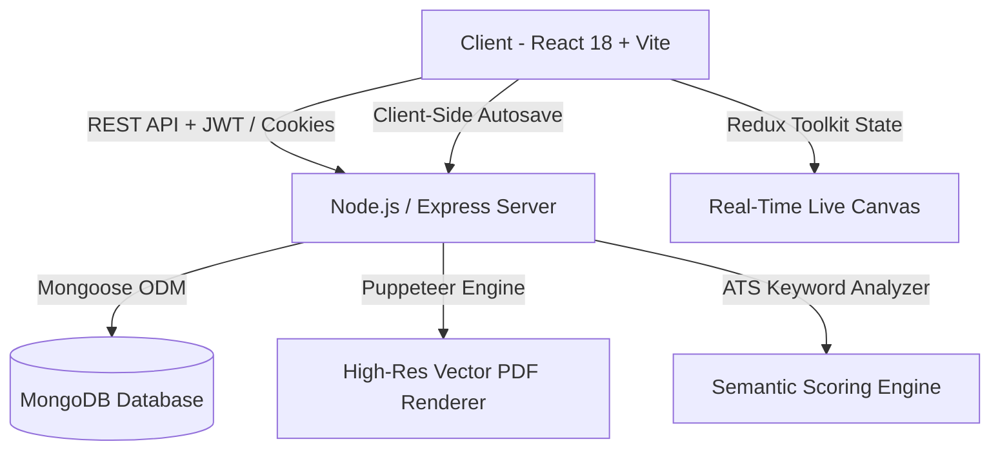

<div align="center">

# ✨ Careerly — ATS Resume Builder & Career Tools

> *"Your career deserves a resume that opens doors — precision-engineered for dream roles."*

[](https://reactjs.org/)
[](https://nodejs.org/)
[](https://expressjs.com/)
[](https://www.mongodb.com/)
[](https://tailwindcss.com/)
[](https://redux-toolkit.js.org/)
[](https://opensource.org/licenses/MIT)

<p align="center">
  <b>Careerly</b> is a full-stack resume and career application built with React, Node.js, Express, and MongoDB. It provides resume creation, ATS-oriented analysis, customizable templates, cover letter generation, and PDF export.
</p>

---

</div>

## 🌟 Highlights & Key Value Points

- 🎯 **ATS-Optimized Formatting**: Engineered to bypass automated filters (Workday, Greenhouse, Lever, Taleo) with 100% single-column semantic structures and standard font fallback hierarchies.
- 🎨 **9 Recruiter-Vetted Templates**: Instant 1-click layout switching (*Jake's Resume, MTeck, Anubhav, Knyte, Modern Accent, Professional, Minimal, Creative, Austere*) preserving all entered data seamlessly.
- 🛡️ **Frictionless Safety PIN Auth**: Reset forgotten passwords instantly using your email and secure 4–6 digit Safety PIN — zero email waiting or expired verification tokens.
- ✍️ **AI Job Description Cover Letter Engine**: Match job descriptions against your resume achievements to auto-generate customized, highly persuasive cover letters.
- 🌙 **Harmonious Dark & Light Mode**: Seamless theme switching with high contrast and zero mismatched color artifacts.

---

## 📸 Architecture & Feature Overview



### 1. 🎯 Precision ATS Scoring Engine
- **Semantic Keyword Extraction**: Parses job descriptions into unigrams and bigrams, calculating precision match percentages.
- **Power Action Verb Analyzer**: Audits bullet points for over 100+ executive, engineering, and leadership action verbs.
- **Quantifiable Metrics Detector**: Recognizes revenue, percentages, speedups, and KPI scale data points.
- **Actionable Suggestions**: Provides instant, categorized feedback (Strengths vs. Recommended Improvements).

### 2. 📝 Full-Featured Resume Editor
- **10 Modular Form Sections**: Personal Info, Summary, Experience, Education, Skills, Projects, Certifications, Languages, Achievements, and Interests.
- **Drag & Reorder Controls**: Reorder entries and shift top-level sections up/down with live preview synchronization.
- **Custom Section Renaming**: Rename any section header to match regional or industry terminology.
- **Typography & Scale Controls**: Choose across 7 font families, 9 curated color schemes, line-height options, and uniform title/body font scaling sliders.

### 3. 💌 Tailored Cover Letter Suite
- Link cover letters directly to existing resumes.
- Paste target job descriptions to identify keywords and align company-specific competencies.
- Dedicated standalone vector PDF export for cover letters.

### 4. 🔐 Security & Identity Management
- **Stateless & Cookie Session Hybrid**: Protected via HTTP-Only SameSite cookies + JWT bearer fallback.
- **Strict Password Strength Criteria**: Enforces 8+ characters, uppercase, lowercase, numbers, and special symbols with live visual criteria trackers.
- **Multi-Tenant Privacy**: Strict user-level data isolation via Mongo indexing and controller tenancy filters.

---

## 🛠️ Complete Tech Stack

| Domain | Technology | Purpose |
| :--- | :--- | :--- |
| **Frontend Framework** | React 18 (Vite build tool) | Ultra-fast HMR and optimized asset bundling |
| **State Management** | Redux Toolkit & React-Redux | Global slices for auth, active resume, and UI states |
| **Styling & Icons** | Tailwind CSS & Lucide React | Clean, scalable design system with dark/light themes |
| **Form Handling** | React Hook Form & Zod | Type-safe form validation and reactive controls |
| **Backend Runtime** | Node.js & Express.js (ES Modules) | Scalable REST API with modular controllers and services |
| **Database & ODM** | MongoDB & Mongoose | Flexible document schemas with deep subdocument support |
| **PDF Generation** | Puppeteer (Headless Chromium) | High-DPI server-side vector PDF generation |
| **Security** | Helmet, bcryptjs, Rate-Limiting | Enterprise-grade HTTP security headers and password hashing |

---

## 🚀 Quick Start Guide

### Prerequisites
- **Node.js**: v18.x or higher
- **MongoDB**: Local instance running on `mongodb://localhost:27017` or MongoDB Atlas URI

### 1. Clone the Repository
```bash
git clone <YOUR_NEW_REPO_URL>
cd Resume_builder
```

### 2. Install Dependencies
Install root, backend, and frontend packages with a single command:
```bash
npm run install:all
```

### 3. Environment Configuration
Create a `.env` file in the `server/` directory:
```env
PORT=5000
NODE_ENV=development
MONGODB_URI=mongodb://localhost:27017/careerly_db
JWT_SECRET=JWT_SECRET=your_random_jwt_secret
JWT_EXPIRES_IN=7d
CLIENT_URL=http://localhost:5173
```

### 4. Run Development Servers
Start both the Express backend and Vite frontend concurrently:
```bash
npm run dev
```

- 🌐 **Frontend**: `http://localhost:5173`
- ⚙️ **Backend API**: `http://localhost:5000`
- 🩺 **Health Check**: `http://localhost:5000/api/health`

---

## 📂 Project Structure

```text
Careerly/
├── client/                     # Frontend Application
│   ├── src/
│   │   ├── components/         # Reusable UI primitives (Button, Modal, Input, Badge, etc.)
│   │   ├── features/           # Feature modules (ATS Score Modal, LivePreview, Forms)
│   │   ├── layouts/            # AppLayout, AuthLayout
│   │   ├── pages/              # Landing, Dashboard, ResumeEditor, Preview, Auth pages
│   │   ├── services/           # Axios API services
│   │   ├── store/              # Redux slices (authSlice, resumeSlice, uiSlice)
│   │   ├── templates/          # 9 ATS Resume Templates + ResumeRenderer
│   │   └── utils/              # Constants, formatting helpers, and default resumes
│   └── vite.config.js          # Optimized Rollup chunks and proxy configuration
│
├── server/                     # Backend API & Engines
│   ├── src/
│   │   ├── config/             # DB connection, constants, environment setup
│   │   ├── controllers/        # Auth, Resume, CoverLetter, User controllers
│   │   ├── middleware/         # Auth token verification, error handler, rate limiters
│   │   ├── models/             # User, Resume, and CoverLetter Mongoose models
│   │   ├── routes/             # Express API routes
│   │   ├── services/           # ATS scoring, PDF generation, auth, and resume logic
│   │   └── validators/         # Zod schemas for backend request validation
│   └── server.js               # Application entry point
│
└── package.json                # Root orchestration scripts
```

---

## 📡 REST API Reference

### 🔐 Authentication (`/api/auth`)
| Method | Endpoint | Description | Access |
| :--- | :--- | :--- | :--- |
| `POST` | `/api/auth/register` | Register new user with email & Safety PIN | Public |
| `POST` | `/api/auth/login` | Sign in & set secure HTTP-only cookie | Public |
| `POST` | `/api/auth/logout` | Clear cookie session | Authenticated |
| `GET` | `/api/auth/me` | Fetch active user profile session | Authenticated |
| `POST` | `/api/auth/forgot-password-pin` | Reset password directly via Email + Safety PIN | Public |

### 📄 Resume Management (`/api/resumes`)
| Method | Endpoint | Description | Access |
| :--- | :--- | :--- | :--- |
| `GET` | `/api/resumes` | Get user resumes (search, sort, filter) | Authenticated |
| `POST` | `/api/resumes` | Create new resume with starter template | Authenticated |
| `GET` | `/api/resumes/:id` | Fetch single resume by ID | Authenticated |
| `PUT` | `/api/resumes/:id` | Update resume contents and settings | Authenticated |
| `DELETE` | `/api/resumes/:id` | Delete resume | Authenticated |
| `POST` | `/api/resumes/:id/duplicate` | Clone resume with auto-incremented title | Authenticated |
| `PATCH` | `/api/resumes/:id/rename` | Quick rename resume title | Authenticated |
| `POST` | `/api/resumes/:id/score` | Compute real-time ATS match score | Authenticated |
| `GET` | `/api/resumes/:id/pdf` | Export high-res vector PDF via Puppeteer | Authenticated |

### 💌 Cover Letters (`/api/cover-letters`)
| Method | Endpoint | Description | Access |
| :--- | :--- | :--- | :--- |
| `GET` | `/api/cover-letters` | Fetch all user cover letters | Authenticated |
| `POST` | `/api/cover-letters` | Create new cover letter | Authenticated |
| `GET` | `/api/cover-letters/:id` | Get single cover letter | Authenticated |
| `PUT` | `/api/cover-letters/:id` | Update cover letter content | Authenticated |
| `DELETE` | `/api/cover-letters/:id` | Delete cover letter | Authenticated |
| `GET` | `/api/cover-letters/:id/pdf` | Export cover letter PDF | Authenticated |

---

## 💡 Contributing

Contributions, issues, and feature requests are welcome!
1. Fork the Project
2. Create your Feature Branch (`git checkout -b feature/AmazingFeature`)
3. Commit your Changes (`git commit -m 'feat: Add some AmazingFeature'`)
4. Push to the Branch (`git push origin feature/AmazingFeature`)
5. Open a Pull Request

---

## 📄 License

Distributed under the **MIT License**. See `LICENSE` for more information.

<div align="center">

**Built with precision for career growth.** &bull; [Careerly Platform](http://localhost:5173)

</div>
